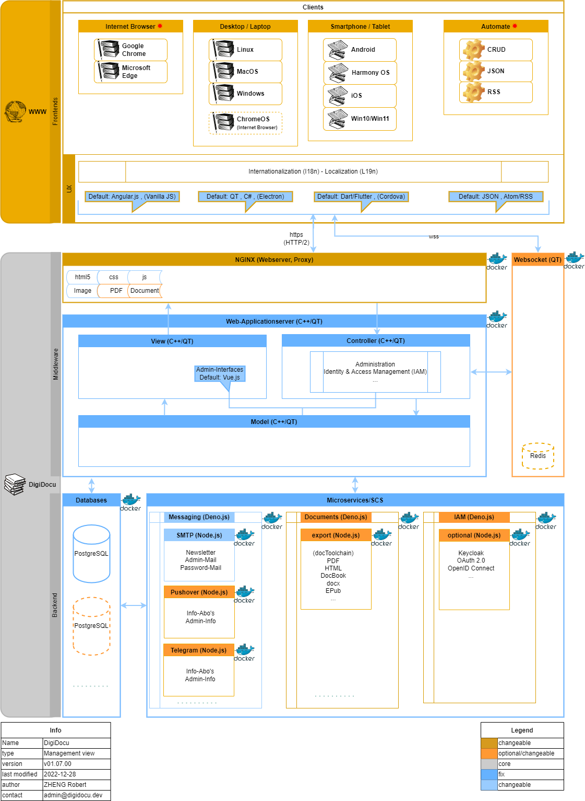
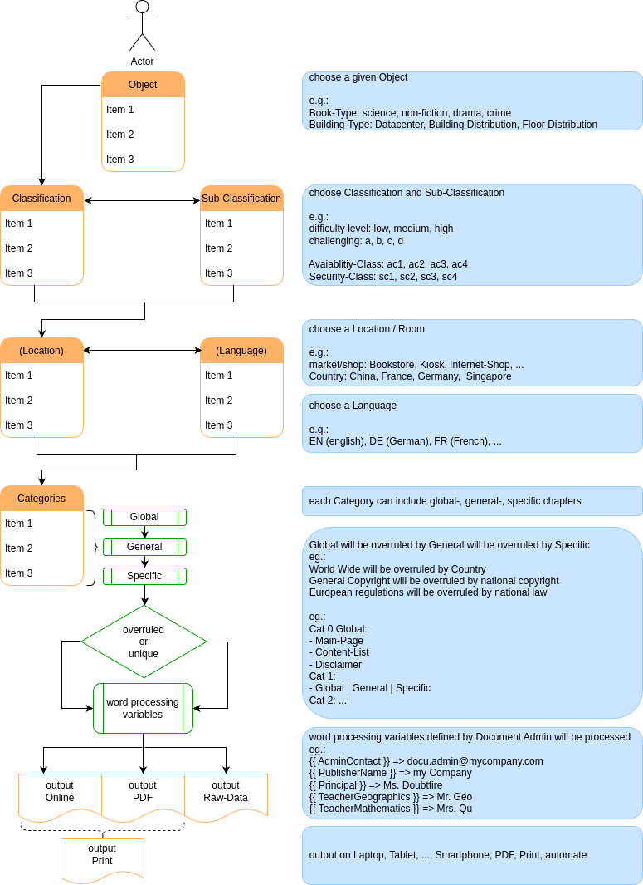

# itis_digidocu_dev

## Brief

A RWA for documenting standards of (passive) IT-Infrastructure and Products. Based on digidocu.dev

> \[!CAUTION]
> itis.digidocu.dev is outdated and deprecated. Please see here: [https://www.digidocu.dev](https://www.digidocu.dev/architecture_v3.html)

## Comment

based on [TreeFrog Framework](https://github.com/treefrogframework)

# Architecture

## Management View

## Functional View

# License

>)

Copyright 2029 ZHENG Robert

Licensed under the Apache License, Version 2.0 (the "License");
you may not use this file except in compliance with the License.
You may obtain a copy of the License at

       http://www.apache.org/licenses/LICENSE-2.0

Unless required by applicable law or agreed to in writing, software
distributed under the License is distributed on an "AS IS" BASIS,
WITHOUT WARRANTIES OR CONDITIONS OF ANY KIND, either express or implied.
See the License for the specific language governing permissions and
limitations under the License.
